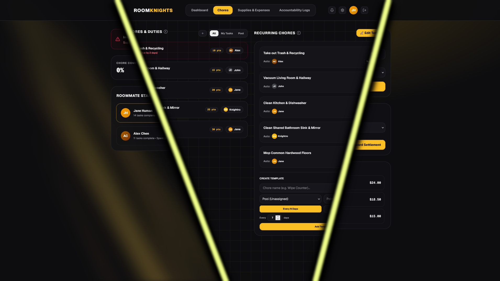

<p align="center">
  <h1>RoomKnights</h1>
</p>


A roommate management portal for coordinating chores, shared expenses, and household accountability. Built as a prototype for a university HCI course (CAP 3104) around a four-person UCF household scenario.

## Core Features

- **Chores** — assign, claim, and complete household tasks with a points system; recurring chore templates with configurable schedules
- **Supplies & Expenses** — track shared inventory status and log split bills; settle debts directly between roommates
- **Accountability** — leaderboard of roommate contributions with audit log and nudge system
- **Appearance** — user-selectable accent color, animated backgrounds (beams, grid, glow, dots), and light/dark theme; all preferences persisted per session
- **Accessibility** — colorblind filter modes (deuteranopia, protanopia, tritanopia, high contrast) and audio feedback toggles

<p>
  
</p>

## Running Locally

After cloning this repo, in your terminal:

```bash
npm install
npm run dev
```

Open [http://localhost:3000](http://localhost:3000)
