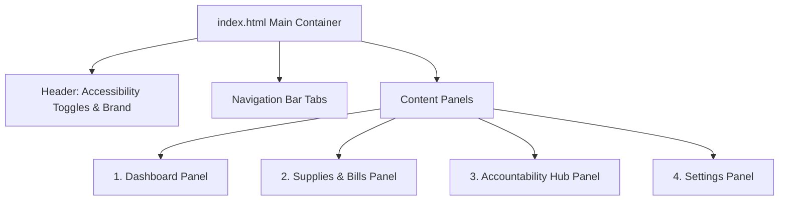

# RoomKnights Design & Prototyping Implementation Plan

This document details the design and prototyping plan for **RoomKnights** (formerly the design/prototype stage), a roommate management application tailored for UCF college students. It translates the findings, personas, and requirements from the [Requirements Analysis](file:///c:/Users/divex/source/repos/cis4524/RoomKnights/requirements-analysis.md) into concrete design specifications, layouts, and interactive features.

---

## 1. Design System & Aesthetics (UCF Branding)

To appeal to UCF college students and establish visual familiarity, the interface will adopt a premium dark-theme dashboard styled with UCF's core color palette:

* **Primary/Background Color**: Obsidian Black (`#121212` / `#1B1B1B`) for sleekness and reduced visual fatigue during late-night study sessions.
* **Secondary/Card Background**: Charcoal Gray (`#242428`) to separate dashboard widgets/modules visually.
* **Accent Colors**: UCF Gold (`#FFC909` / `#D4AF37`) for active tabs, highlight states, call-to-action buttons, and completion metrics.
* **Typography**: Primary font will be **Inter** or **Outfit** (via Google Fonts), emphasizing clean readability, strong hierarchy, and generous spacing.
* **Visual Polish**: Curated linear gold-to-dark gradients, subtle drop shadows on cards to denote elevation, and active micro-animations on interactive elements (e.g. checkmarks scaling up/down, transitions on navigation tabs).

---

## 2. Core Features (Justified by Requirements Analysis)

| Page/Module | Feature | Requirement ID / Justification | HCI Principle Applied |
| :--- | :--- | :--- | :--- |
| **All Pages** | Colorblind & Accessibility Filters | **Req 10**: John (Persona 2) or other users may have color vision deficiencies. Toggle switches allow Deuteranopia, Protanopia, and Tritanopia overrides. | **Accessibility**: Information is never conveyed *only* by color; textures, text labels, and icons (e.g., ✅ and ⚠️) change alongside palettes. |
| **Dashboard** | My Chores (Checklist) | **Req 2 & 3**: Keeps John Computer organized. Clearly defines due dates and checkboxes to avoid cognitive overhead. | **Feedback**: Immediate checkmark transition and updated progress gauges visually satisfy the *Gulf of Evaluation*. |
| **Dashboard** | Unassigned Chore Pool | **Req 1**: Realization of user interviews where tasks get forgotten. Roommates can proactively claim unassigned chores. | **Affordance & Signifiers**: Claim buttons use active UCF Gold signifiers to suggest clickability. |
| **Supplies & Bills** | Shared Supply Inventory | **Req 4**: Jane’s scenario where supplies run low. Shows "In Stock", "Running Low", and "Out of Stock" status. | **Conceptual Models**: Visual indicator icons replicate physical storage status to match the user's real-world mental model. |
| **Supplies & Bills** | Auto-Assign Supply Buyer | **Req 5**: Distributes grocery/supply costs fairly. Auto-assigns low items to the roommate with the lowest financial contribution score. | **Error Prevention & Efficiency**: Reduces friction and prevents roommate arguments by automating task allocation. |
| **Accountability Hub** | Leaderboard & Roommate Status | **Req 7**: Jane's frustration with group chat reminders being ignored. Allows setting a "Group Leader" to ensure task validation. | **Social Constraints**: Visual accountability dashboards encourage compliance without direct personal conflict. |
| **Accountability Hub** | The "Nudge" System | **Req 7**: Allows Jane or Alex to send structured reminders/alerts to roommates with overdue tasks. | **Gulf of Execution**: A single button click handles communication, removing the awkwardness of typing a direct text message. |
| **Settings** | Busy Week Mode | **Req 6**: Alex Chen’s (Persona 3) scenario. Allows users to mute/snooze non-urgent notifications during finals week. | **User Control & Freedom**: Promotes user agency and emotional well-being by allowing customized alert profiles. |

---

## 3. Prototype Architecture (Single-Page App Layout)

The prototype will be built as a responsive Single-Page Application (SPA) using HTML5, CSS Grid/Flexbox, and Vanilla JavaScript. This ensures loading speeds well within the **3-second threshold (Req 8)**.

### Site Map / Panel Navigation:

---

## 4. End-to-End Scenarios for Usability Testing

The prototype will implement fully functional navigation, active buttons, and state changes to support these two scenarios without verbal intervention:

### Scenario A: Jane's Supply Low & Accountability Workflow
1. **Entry**: Jane (Persona 1) logs into the dashboard, views outstanding chores, and notices things are messy.
2. **Action 1 (Supply low)**: She clicks the **Supplies & Bills** tab, locates "Trash Bags," and sees it is marked as *In Stock*. She toggles it to *Low/Out*.
3. **Action 2 (Auto-assign)**: The system recalculates household contributions and highlights that John has spent the least. She clicks **Auto-Assign Purchaser**, which locks John to the purchase task.
4. **Action 3 (Accountability)**: She navigates to the **Accountability Hub**, sees that John has a task overdue, and clicks the **Nudge** button.
5. **Outcome**: The interface displays a success confirmation message (e.g. "Reminded John about Trash Bags & Vacuuming") confirming the actions.

### Scenario B: John's Chore Completion & Expense Split Workflow
1. **Entry**: John (Persona 2) logs in, receives a prominent dashboard banner notification: *"Reminder: Vacuuming is due today!"*
2. **Action 1 (Checklist)**: John expands the "Vacuum Living Room" task on his Dashboard, showing a sub-checklist (Vacuum rug, vacuum under couch, empty canister). He checks off all three items.
3. **Action 2 (Task Completion)**: He clicks **Submit Task**. The task disappears from his checklist, and the overall dashboard compliance score increments.
4. **Action 3 (Expense Input)**: He moves to **Supplies & Bills**, enters an expense for purchasing trash bags (e.g., "$15.00"), selects "Split Equally", and submits.
5. **Outcome**: The financial matrix updates, showing John's balance adjusted and other roommates' debt adjusted accordingly.

---

## 5. Next Steps

1. Maintain this design layout as the template guide.
2. Verify all UI assets align with the UCF theme palette.
3. **Wait for explicit approval to begin writing code files (`index.html`, `style.css`, `app.js`).**
